# Process Flow — Loop Boundaries

How work crosses from the **Specification loop** to the **Coding loop** to the **Verification /
Operations loop** and into production, and back. Terms in **bold** are defined in the
[glossary](../glossary.md); the loops themselves are described in [architecture.md](./architecture.md).

**Scope of this document.** This maps the *boundaries* — what artifact crosses, what gate it
must clear, who owns the gate, and where it goes when it fails. The loops' internals are owned by
their agents, not specced here: the Coding loop by
[`neo.technical-engineer.agent.md`](../../plugins/neo-core/agents/neo.technical-engineer.agent.md)
(summarized in [architecture.md § Coding loop in detail](./architecture.md#coding-loop-in-detail)),
and the Verification / Operations loop by
[`neo.business-engineer.agent.md`](../../plugins/neo-core/agents/neo.business-engineer.agent.md)
(verification), [`neo.platform-engineer.agent.md`](../../plugins/neo-core/agents/neo.platform-engineer.agent.md)
(deployment), and [`neo.sre.agent.md`](../../plugins/neo-core/agents/neo.sre.agent.md) (operations)
(summarized in
[architecture.md § Verification / Operations loop in detail](./architecture.md#verification--operations-loop-in-detail)).

**Status key:** `[live]` designed and drafted · `[target]` end-state design, not yet specced.

---

## The chain

| # | Boundary | Artifact that crosses | Gate | Gate owner | Status |
| --- | --- | --- | --- | --- | --- |
| — | **Product → Specification** | A **PRD** | PRD is segmentable — each segment carries its own business justification | BE (human), on a `neo-product` PRD | `[live]` |
| **1** | **Specification → Coding** | One **Task** | Task-authoring conformance + BE-approved task set | BE (human) | `[live]` |
| **2** | **Coding → Verification** | One draft **PR** | **Validation** green + code review approved | Machine, then human | `[live]` |
| **3** | **Verification → Deployment** | One verified **Feature** + its verification record | **Verification** steps pass, falsification pass included | BE (human judgment) | `[live]` |
| **4** | **Deployment → Operations** | One deployed feature + its **deployment record** | CD green + production smoke pass | Neo Platform Engineer (machine); received by Neo SRE | `[live]` |

The unit changes at every boundary. That is the point, and it is also where the seams are:
the spec loop thinks in **features**, the coding loop thinks in **tasks**, the
verification loop thinks in **features** again, and operations thinks in a feature's **KPI
hypotheses**. Boundary 2 is therefore not 1:1 — N task PRs
fan in to one verifiable feature. How that assembly happens is the
[integration mode](#integration-modes), a project-level choice with a Neo default.

---

## Boundary 0 — Product → Specification

`[live]`. Formerly written as "PRD → Specification" with an unspecified origin — Neo assumed a
PRD simply existed. The **Product loop** (`neo-product`) is what produces it.

**What crosses.** One **PRD**, authored by the **Product Engineer** in `docs/design/requirements/`
after research fan-out, the three lenses (viability, desirability, feasibility), and a human
decision to proceed. Format is owned by the `neo-product-requirements` skill.

**Entry gate.** The PRD must be **segmentable**: a reader can carve it into independent chunks,
each carrying its own business justification. That is the contract — the Specification loop
consumes *segments*, not whole documents, so a PRD that cannot be segmented cannot be consumed.
Supporting criteria: measurable success criteria, explicit non-goals, prioritized requirements
(P0/P1/P2), and honestly-stated open assumptions.

**Gate owner.** The **BE** (human). The Product loop hands the PRD over and stops; it never
invokes `feature-agent` or `task-planner` itself.

**On failure.** Back into the Product loop — usually to the lens that produced the weak section,
or to a fresh research fan-out when the gap is factual rather than analytical.

**Note.** This boundary is numbered 0 because the loops it joins were specced in the other
order; the chain reads Product → Specification → Coding → Verification → Deployment → Operations.

---

## Boundary 1 — Specification → Coding

`[live]` on both sides — the Technical Engineer's intake step enforces the receiving side (see Drift).

**What crosses.** Exactly one **Task**: the spec-level unit, derived from exactly one
BE-signed feature, sized to roughly one pull request, carrying machine-checkable validation
criteria. The task is self-contained — a Coder needs no further business input to work it.

**Entry gate.** All must hold:

1. The parent **Feature** is BE-signed and carries What + Why + verification steps.
2. The task conforms to the `neo-task-authoring` skill — title, parent-feature link, What, and
   validation criteria that are machine-checkable.
3. The task belongs to a **BE-approved task set**, not an agent-emitted one. Feature→Task
   decomposition is interactive and converges with the BE; a task from an unapproved split
   does not cross.

**Gate owner.** The BE. This is a human gate by design — a bad split poisons everything
downstream, so no agent may open it alone.

**Who carries the task across.** Either the BE hands a filed task to `neo-technical-engineer`
directly, or `neo-business-engineer` does it for them: once the BE has approved the task *set*,
it files each task as its carrier issue and spawns one session per task running the Technical
Engineer — parallel where tasks are independent, `base_branch`-chained where one depends on
another. That changes *who does the carrying*, not who owns the gate. The orchestrator sequences
and spawns; the human still signs the feature and approves the set. (Session spawning is a
Copilot desktop-app capability — see
[`agent-authoring-reference.md` § Host tools](../contributing/guides/agent-authoring-reference.md).)

**On rejection.** A task that fails the gate does not get patched in the coding loop. A gap
in the task goes back to the `task-planner`; a gap in the *feature* goes back to the BE and
the `feature-agent`. Downstream agents never invent scope to fill a hole — that rule is
already binding in `neo.task-planner.agent.md` and `neo-code-writer.md`.

**Drift to reconcile.** `neo-technical-engineer` declares its input as "a GitHub Issue or
Azure DevOps story." The spec loop emits a **Task**. These need to be the same object: a Neo
Task should *be* the issue/story it is filed as, so the orchestrator's input contract and the
task-planner's output contract describe one artifact rather than two. **Resolved** — this is
now the carrier rule fixed in [`task-handoff-schema.md`](../contributing/reference/task-handoff-schema.md) § 1,
and `neo-technical-engineer` enforces it on receipt: its intake step checks every required field
and the `be-approved` marker, and routes a failing task back rather than patching it.

---

## Boundary 2 — Coding → Verification

`[live]`.

**What crosses.** One **draft pull request** implementing one task, with its validation
criteria green. Its shape — which branch it targets under each integration mode, its required
body sections, and its closing keyword — is owned by the `neo-pr-authoring` skill.

**Entry gate.** All must hold:

1. **Validation passes** — the task's machine-checkable criteria run to a deterministic pass
   on the branch head, each proven by a check `Neo Validator` actually ran. A criterion with no
   runnable proof fails. No human judgment participates in this gate; that is the definition of
   validation.
2. **Build, lint, and tests pass** for every layer the change touched.
3. **Code review approved** by the reviewer agent, for both the feature/fix steps and the
   test steps.
4. The PR is linked to its parent task, and through it to the parent feature.

**Gate owner.** Per step, the machine (the writer's build/lint/tests) then the reviewer agent;
per task, the machine again (`Neo Validator`, against the integrated head); then a human on the
PR. The PR stays a **draft** — no agent marks it ready or merges it.

**On rejection.** A reviewer's findings loop back inside the coding loop — passed verbatim to
the writer, re-reviewed, repeated until approved. This is an *internal* loop and does not
cross the boundary. A failed validation loops back the same way: each failing or unproven
criterion becomes a new step, is reviewed, and the task is validated again. Only a stalled loop
(the same finding, or the same failing criterion, twice with no progress) escalates to a human.

**Commits.** The coding loop owns the commit step: `neo-code-writer` commits each completed
**step** to the task branch once build/lint/tests are green, one commit per step, in
[Conventional Commits](https://www.conventionalcommits.org/) form (`<type>[scope]: <desc>`).
These per-step commits are what later squash to **one commit, one feature** (see
[Mode A](#mode-a--feature-branch-squash-to-main-default) below). Conventional Commits is the
required format; a consuming repo may define its own scopes and additional types in its
`AGENTS.md`, but stays within Conventional Commits.

**The fan-in.** One PR closes one task. **Verification is per-feature.** So crossing this
boundary with a single PR is necessary but not sufficient — the verification loop cannot start
until *every* task under the parent feature has landed. What performs that assembly is the
project's [integration mode](#integration-modes).

**Drift to reconcile.** Diagram 2 draws `Testing` as its own phase after `Implement`, but
`neo-implementation-planner` emits test units interleaved with feature units and
`neo-code-writer` implements whichever it is assigned. Two different models of the same phase.
**Resolved — interleaved labeled steps.** Every step is labeled `[feature]` or `[test]`,
sequenced by its dependencies, and reviewed on its own; Diagram 2's `Testing` box is a step
label, not a phase. The planner's coverage map ties each validation criterion to the test step
that proves it, which is what task-level validation runs.

---

## Boundary 3 — Verification → Deployment

`[live]`. The run and its records are owned by the `neo-feature-verification` skill; the
**Neo Business Engineer** walks the BE through it.

**What crosses.** One **verified Feature** — all child tasks merged, and the feature's
verification steps executed and passed — together with its **verification record**, posted on the
feature's carrier (the issue its tasks name as `Parent feature`).

**Before the gate.** Verification does not start until three things hold:

1. **Fan-in** — every task in the BE-approved set has landed on the integration target (see
   [Boundary 2 § The fan-in](#boundary-2--coding--verification)). The Neo Business Engineer checks.
2. **A pinned non-prod deploy** of the integration target — one known SHA, the one the release
   would carry. The **Neo Platform Engineer** deploys it, using the consuming repo's declared
   non-prod deploy; under Mode A it refuses an integration branch that is behind the default branch,
   because verification must run against what will land.
3. **Green smoke checks** on that SHA. A smoke failure is a deployment problem and never reaches the
   BE's triage.

Each task PR's own review and merge — Boundary 2's human half — happens in Verification Space
before any of this, and is always a human's.

**Entry gate.** The BE executes the feature's **verification steps** in a non-prod
environment and renders a pass/fail judgment on each. These steps are *the contract*, authored
at feature-definition time. If the BE cannot verify it, it does not deploy.

**The question is "try to make it fail."** A confirming question — *does it work?* — finds what it
looks for. Verification keeps its name and its core rule but is **falsification-framed** in two
ways ([framework-gap-analysis.md § G3](../contributing/design/framework-gap-analysis.md)):

- **The goalposts are frozen.** The steps were pre-registered when the BE signed the feature and
  are run exactly as signed. A wish to change a step mid-run is not an edit; it is evidence the
  feature was **mis-specified**, and it is recorded that way.
- **Every step gets an attempt to break it.** After running a step as written, the BE runs at least
  one disconfirming variation — a boundary input, the wrong actor, an interrupted flow. The agent
  may suggest variations; the BE chooses, runs, and judges them. The feature is `verified` only if
  every step, attempt included, passes.

The run is pinned to the deployed SHA; if that SHA changes mid-run, the run is void.

**Gate owner.** The BE, exercising human judgment. This is the inverse of Boundary 2's
machine gate, and deliberately so: **verify features, validate tasks; humans verify, machines
validate.** The Neo Business Engineer sequences, suggests, and records; it never renders a verdict.

**On pass — the release.** The Neo Platform Engineer prepares it, and a human performs it. Under
Mode A it opens a **draft** feature PR from the integration branch to the default branch, whose body
closes every child task and carries the traceability lines the squash commit needs; a human
squash-merges it (see [Traceability under squash](#traceability-under-squash)). Under Mode B a human
turns the feature's flag on in production. Either way, production then changes only through the
project's own CD — never by an agent's hand — and the feature moves on to
[Boundary 4](#boundary-4--deployment--operations).

**On rejection — the triage.** A failed verification does not carry its own diagnosis. It says
the feature does not behave as expected; it does not say why. Resolving that is a **human
investigation step, and a first-class part of this loop** — not a routing decision an agent
infers from the failure.

The investigation returns one of three findings:

| Finding | Meaning | Routes to |
| --- | --- | --- |
| **Mis-built** | The contract is correct; the implementation does not satisfy it. | **Coding loop** — new task under the same, unchanged feature. |
| **Mis-specified** | The contract itself is wrong, incomplete, or names the wrong outcome. What was built may faithfully satisfy it. | **Specification loop** — `feature-agent`, re-sign the feature. |
| **Both** | The contract is wrong *and* the implementation does not satisfy even the contract as written. | **Specification loop first**, then Coding. See ordering rule. |

**Ordering rule for "both."** Fix the specification before the implementation. Re-signing the
feature can change what "built correctly" means, so code written against the old contract may
be work thrown away — or worse, work that passes and entrenches the wrong behavior. Spec
first, then re-decompose, then build. Never run the two repairs in parallel.

**Gate owner.** The BE owns the investigation and the routing call. Both must be explicit and
recorded. Defaulting a failed verification to "write more code" is precisely how a
mis-specified feature gets built twice.

**Record with every rejection** — posted on the feature's carrier beside the verification record,
in the shape the `neo-feature-verification` skill defines:

- Which verification step failed.
- Observed behavior vs. the behavior the contract promised.
- The finding — mis-built, mis-specified, or both — and the evidence for it.
- Where it routed, and what changed as a result.

This record is the loop's learning signal. A feature that comes back mis-specified twice is
telling you something about the Specification loop, not about the coders. Mis-specified findings
that pile up across the features of one PRD segment say something about the PRD itself — see
[Strategic-reopen candidates](#strategic-reopen-candidates-provisional).

---

## Boundary 4 — Deployment → Operations

`[live]`. Formerly an unnumbered row with no defined boundary: Diagram 2 draws **Deployment Space**
and **Operations Space** as separate regions, with Operations Space floating outside every loop.
This section defines the line between them.

### The three spaces

The fourth loop runs through three spaces, each with its own human owner and Neo agent:

| Space | Holds | Human | Agent | Ends when |
| --- | --- | --- | --- | --- |
| **Verification Space** | Task PR review and merge, fan-in, the non-prod deploy for verification, the BE's verification and triage | Business Engineer | Neo Business Engineer (+ Neo Platform Engineer for the deploy) | The feature is `verified` — Boundary 3 |
| **Deployment Space** | Release mechanics: the Mode A feature PR and squash or the Mode B flag release, production CD, production smoke checks, and executing a rollback | Platform Engineer | Neo Platform Engineer | The feature is live in production, its CD run is green, and its production smoke checks pass — Boundary 4 |
| **Operations Space** | The *running* feature over time: instrumentation intake, the post-deploy watch, and KPI settlement | Site Reliability Engineer | Neo SRE | Every KPI the feature shipped with has settled |

```mermaid
flowchart LR
  subgraph SPEC[Specification loop]
    F[Feature, BE-signed] --> TS[Task set, BE-approved]
  end
  subgraph CODE[Coding loop]
    T[Task] --> PR[Draft task PR]
  end
  subgraph VER[Verification Space]
    RV[Human review + merge] --> FI[Fan-in] --> NP[Non-prod deploy + smoke] --> V{BE verifies}
  end
  subgraph DEP[Deployment Space]
    REL[Feature PR / flag release] --> HM[Human squash-merge / flag flip] --> CD[Project CD + prod smoke]
  end
  subgraph OPS[Operations Space]
    IN[Intake: KPIs emitting?] --> W[Post-deploy watch] --> S{KPI settlement}
  end
  TS -- "B1: one task" --> T
  PR -- "B2: draft PR" --> RV
  V -- "B3: verified" --> REL
  CD -- "B4: deployment record" --> IN
  V -- "rejected: mis-built" --> T
  V -- "rejected: mis-specified / both" --> F
  W -- "rollback: human decides" --> REL
  S -- "falsified / unsettleable" --> F
  S -. "strategic-reopen candidate" .-> PRD[Product loop: PRD]
```

### The boundary

**What crosses.** One **deployed feature** and its **deployment record**, posted on the feature's
carrier: what was released (the squash SHA, or the flag), the CD run and its result, each production
smoke check and its result, the rollback unit, and the feature's KPIs copied verbatim from the signed
feature. Its shape is owned by the `neo-release-authoring` skill.

**Gate.** The project's CD run for the released commit succeeded, and every production smoke check
passed. Both are machine checks. Smoke checks are read-only by rule — a check that would change
production state is not run.

**Gate owner.** The **Neo Platform Engineer** runs the checks and writes the record: this is a
machine gate, like Boundary 2's validation. It never *causes* the deploy. Production changes only
through the project's own CD after a human merge, or by a human flipping a flag.

**Receiving side.** The **Neo SRE**'s intake, the way the Technical Engineer's intake receives
Boundary 1. It re-checks each KPI's admissibility (the [falsifiability gate](#falsifiability-is-a-gate-on-kpi-authoring)
and the [captive-population rule](#internal-line-of-business-portfolios)) and confirms each KPI's
instrumentation is **emitting in production**. A KPI that fails either check is recorded
**unsettleable at intake** and routed to the Specification loop at once — waiting out its window
cannot repair it. Intake opens the settlement watch; the feature's carrier stays open until every KPI
has settled, so the open, deployed features are Operations' outstanding debt to the Specification
loop.

**On failure — rollback, then triage.** A failed CD run, a failed production smoke check, or a
post-deploy regression the Neo SRE detects against the health signals the consuming repo declares
all end the same way: a **rollback recommendation** to the humans, with evidence. A human decides.
The Neo Platform Engineer prepares the rollback — a draft revert of the feature's squash commit
under Mode A (feature-level revert is one commit; that is what Mode A buys), the flag-off
instruction under Mode B — and a human performs it.

A rollback is not a diagnosis. The failure then goes through the same triage as a Boundary 3
rejection, with one finding added, because after verification the environment can be what's wrong:

| Finding | Meaning | Routes to |
| --- | --- | --- |
| Mis-built · Mis-specified · Both | As at [Boundary 3](#boundary-3--verification--deployment). | As at Boundary 3, with the same ordering rule. |
| **Mis-deployed** | The contract and the code are both fine; the release, configuration, or environment is wrong. | **Deployment Space** — the human Platform Engineer. |

Without the fourth finding, an environment fault defaults to "write more code" — the failure the
triage exists to prevent. Boundary 3 needs no such row: a non-prod environment fault fails the smoke
checks and stops *before* the BE verifies.

---

## Feedback edges

Six edges run backward. All are designed; the last is deliberately provisional.

**Review → Implement** `[live]` — inside the coding loop. Reviewer findings return to the
writer verbatim. Bounded: a repeated finding with no progress escalates to a human.

**Validation → Implement** `[live]` — inside the coding loop. Each criterion the Validator
reports `fail` or `unproven` becomes a new step, reviewed like any other, before the task is
validated again. Bounded the same way: a criterion that fails twice with no progress escalates.

**Verification → Coding or Specification** `[live]` — Boundary 3 rejection, routed by BE
diagnosis as above. The Neo Business Engineer runs the triage interview and carries the route:
new tasks under the unchanged feature, or a re-signed feature and a re-decomposed task set.

**Operations → Deployment** `[live]` — rollback. A failed handover or a post-deploy regression
becomes a rollback recommendation; a human decides, the Neo Platform Engineer prepares it, and the
failure is then triaged as at [Boundary 4](#boundary-4--deployment--operations).

**Operations → Specification** `[live]` — the long edge. A feature's **KPIs** are authored as a
hypothesis; that hypothesis is only settleable in production, from **telemetry**, after the window
closes. Operations owes the Specification loop a verdict on every feature that shipped with KPIs.
The Neo SRE settles each KPI against its pre-registered falsifier — `supported`, `falsified`, or
`unsettleable` — and routes the last two to the BE, who decides what the feature needs. The
procedure is owned by the `neo-kpi-settlement` skill. See [The two fits](#the-two-fits) — this
edge carries the second one.

**Operations or Verification → Product** `[live]`, provisional — the strategic edge. Most reopens
are tactical: one feature goes back to the Specification loop. A few failures point past the feature
at the premise of the PRD it came from. Those raise a *candidate* for the human Product Engineer,
never an automatic reopen.

### Strategic-reopen candidates (provisional)

What earns a *strategic* reopen — one that reopens the PRD and the system it defined, rather than a
feature — is an open question ([framework-gap-analysis.md § G4](../contributing/design/framework-gap-analysis.md)).
Neo does not decide it. It raises a **candidate** when any of these holds:

1. **Two or more falsified KPIs serve the same PRD goal**, across features. Raised by the Neo SRE at
   settlement.
2. **A falsified KPI on a feature that delivers a P0 requirement** — the PRD's own must-have, per the
   feature's Source line. Raised by the Neo SRE at settlement.
3. **Two or more mis-specified verification findings trace to the same PRD segment**, across
   features. Raised by the Neo Business Engineer at verification.

A candidate goes to the human **Product Engineer**, with the records that raised it, and the Product
Engineer decides whether the Product loop reopens. The thresholds are a first guess: how each
candidate was decided is recorded, because that record is what will show whether they are right.
These signals depend on each feature naming its source — the PRD segment, the requirement ids and
priorities it delivers, and the PRD goal each KPI serves — which the `neo-feature-authoring` skill
requires.

---

## The two fits

Verification and KPI settlement are not two checks on the same thing. They establish
different fits, at different times, with different evidence, and a feature can pass one and
fail the other.

| | **Verification** | **KPI settlement** |
| --- | --- | --- |
| Question | Does the feature behave as expected? | Did the change produce the value we claimed? |
| Establishes | **Problem–solution fit** | **Value fit** (in a true market: product–market fit) |
| Proof | Human judgment | Production telemetry |
| Environment | Non-prod | Production |
| Unit | Feature | The feature's KPI hypothesis |
| Timing | Before deploy — **blocking** | After the window closes — **non-blocking** |
| Failure means | Don't ship it | We shipped something that works and didn't matter |

That last cell is the reason the outer edge exists. Verification alone cannot catch a feature
that does exactly what it promised and changed nothing that mattered. Only telemetry can, and
only after the fact.

### Falsifiability is a gate on KPI authoring

A KPI is a hypothesis, and a hypothesis that cannot be falsified is an aspiration. At
feature-definition time, a KPI is admissible only if the BE can name all four:

1. **The metric** — the specific quantity that moves.
2. **The instrumentation** — what emits it, and whether that telemetry exists today or must
   ship with the feature.
3. **The window** — how long until the hypothesis is settleable.
4. **The falsifier** — the result that would count as *disproved*. If no observable outcome
   would falsify it, drop the KPI.

Point 2 has a build consequence: if the telemetry does not exist yet, emitting it is in
scope for the feature. A KPI whose instrumentation never shipped is unsettleable, and the
outer loop silently breaks.

The `neo-feature-authoring` skill enforces this gate: KPIs stay optional, but a KPI missing any
of the four is dropped, not signed. It also carries a **baseline** with each KPI — required under
captivity (below) and whenever the falsifier is relative — and signing the feature **freezes** the
falsifier, just as it freezes the verification steps. The Task Planner carves the work that emits
any instrumentation a KPI needs, and the Neo SRE re-checks all of it at
[Boundary 4](#boundary-4--deployment--operations) intake.

### Internal line-of-business portfolios

Many Neo clients are not in a true market. They build and maintain internal LOB applications
and are increasingly applying a product mindset to the app portfolio. The second fit still
applies, but two adjustments are required.

**Name it value fit, not product–market fit.** There is no market to fit. The general
question — did this change deliver the operational value claimed — holds everywhere; PMF is
its special case where the users are also the buyers and can leave.

**Engagement metrics are inadmissible under captivity.** Internal users do not choose the
app and have no alternative to defect to. Adoption, DAU, session length, and feature usage
therefore measure *compulsion, not value* — a mandatory workflow reaches full adoption whether
it is excellent or miserable. In a captive population these are not weak evidence; they are
invalid evidence, and a KPI built on them will confirm itself no matter what shipped.

Admissible KPIs for internal LOB are **outcome** metrics — quantities that move only if the
feature actually helped:

- cycle time / time-to-complete a task
- error, rework, and exception rates
- cost per transaction
- support ticket or escalation volume
- manual touches eliminated per case

**Mind the counterfactual.** With no churn signal and no competitor, there is nothing to
compare against by default. A captive-population KPI needs a deliberate baseline — a
pre-change measurement, a holdout group, or a staged rollout — designed *at feature-definition
time*, because it usually cannot be reconstructed after the fact. The window should be chosen
to accommodate it.

---

## Integration modes

### Two rules, not one

`neo-task-authoring` previously stated a single "one task ≈ one PR" rule. That conflated two
separate decisions, and only the second is contextual:

- **Task sizing** — a task is one coherent, independently validatable, reviewable chunk of
  change. **Universal. Not optional.** It is what makes validation criteria expressible and
  review tractable. "One PR" remains the unit of *measure* here.
- **Integration target** — where that chunk merges, and what can be atomically reverted
  afterward. **Project-level choice.** Both modes below preserve one-task-one-PR; they differ
  only in what the PR targets.

### The deciding principle

**Revert granularity should match verification granularity.**

The BE verifies **features** — that is what gates ship. So the unit you can cleanly undo when
it misbehaves in production should also be the feature. Mode A aligns the two. Mode B
deliberately breaks the alignment and buys smaller batch size with it.

### Mode A — feature branch, squash to main `[default]`

**Flow.** Each task PRs into a long-lived branch for its parent feature, reviewed and
validated there. When the last child task lands, that branch *is* the verification target —
the BE runs the feature's verification steps against a non-prod deploy of it. On verification
pass, the branch squash-merges to the default branch: **one commit, one feature.** The Neo
Platform Engineer opens that merge as a draft feature PR once the verification record says
`verified` at the branch's head; a human squash-merges it.

The integration branch is named `feature/<feature-id>-<short-name>`. The Neo Business Engineer
creates it before fanning out a feature's tasks; a Technical Engineer run directly on one task
reuses it, or creates it from the default branch if it doesn't exist yet. Because a task PR
targets this branch rather than the default branch, GitHub ignores closing keywords in it: the
PR says `Refs #<task>`, and the tasks close when the squash commit lands carrying their IDs (see
Traceability below and the `neo-pr-authoring` skill).

**Properties.** Feature-level revert is a single commit. The feature can be seen whole in
non-prod with no additional machinery. Fan-in is solved structurally rather than tracked.

**Obligations.** The feature branch must be refreshed from the default branch regularly to
limit drift — by a human, because a refresh can change behavior; verification refuses a stale
branch. Non-prod must be deployable from an arbitrary feature branch, with the command declared
in the consuming repo's `AGENTS.md`. The squash commit body must carry child task IDs — see
Traceability below.

**Costs.** Long-lived branches, integration risk deferred to merge time, merge pain that
grows with feature size.

That last cost is partly a feature. Mode A puts real back-pressure on feature sizing: a
feature too large to hold on a branch is almost certainly too large for the BE to verify as a
single judgment anyway. The pain shows up early, at decomposition, rather than late.

### Mode B — tasks to main behind flags

**Flow.** Each task PRs directly to the default branch, its behavior gated by a feature flag.
A completion tracker fires when every child task of a feature has merged. Verification runs in
non-prod with that feature's flag enabled. On verification pass, the release is turning the flag
on in production — a human's action; the Neo Platform Engineer records it and the cleanup it
leaves owed.

**Entry conditions — all must hold.** Do not choose Mode B without:

1. Feature flag infrastructure already in production use.
2. A non-prod environment where flag state can be set per-feature, per-verification-run.
3. A tracker that knows which tasks belong to which feature and when all have landed.

**Properties.** Smallest batch size, continuous integration, no branch drift. Fast mitigation
in production — disable the flag.

**Costs.** Revert granularity no longer matches verification granularity: the flag toggle
hides the feature, but removing the code is N-commit archaeology. The default branch carries
dormant partial features. Flag cleanup after verification becomes standing debt, and
un-cleaned flags accumulate into a second, undocumented configuration surface.

### Choosing

| | **Mode A** (default) | **Mode B** |
| --- | --- | --- |
| Batch size | Feature | Task |
| Revert unit | Feature — one commit | Flag toggle; code removal is N commits |
| Verification target | The feature branch | Default branch + flag state |
| Requires flag infrastructure | No | **Yes** |
| Branch lifetime | Feature duration | Hours to days |
| Integration risk | Deferred to merge | Continuous |
| Fan-in mechanism | Structural | Tracker + flag state |
| Best fit | Most LOB work; teams without flag infrastructure | Trunk-based teams with mature flags |

Mode A is Neo's default because it matches revert to verification for free, and because the
flag infrastructure Mode B requires is not present in many internal LOB shops. Choose Mode B
deliberately, with its entry conditions met — not by drift.

### Traceability under squash

Squashing collapses per-task commits on the default branch. The feature becomes one commit,
which is exactly what makes it revertable — but it removes task-level history from the graph.

For LOB and regulated clients, the commit → task → feature → requirement chain may be an
audit requirement. Preserve it in the **commit message body** rather than the graph: the
squash commit lists every child task ID and its parent feature ID. Decide this at project
setup; it cannot be reconstructed after the merge. On GitHub, listing each task as
`Closes #<task>` also closes the tasks when the squash lands on the default branch — the Mode A
task PRs could not, because their base was the feature branch.

**Who executes it.** The Neo Platform Engineer writes the traceability into the draft feature PR —
its title becomes the squash subject, and its body lists `Closes #<task>` for every child and the
parent feature as `Refs #<feature>` (the feature itself closes only once its KPIs settle). A human
squash-merges it **with the PR body as the commit message**, pasting it if the repository's default
squash message differs. The shape is owned by the `neo-release-authoring` skill. No agent merges.

---

## Related open items

- **The Diagram 2 PDF (`docs/guides/Agentic Engineering_*.pdf`) is stale and still needs
  redrawing.** Its two drawing bugs are resolved *in text*, which now wins over the drawing:
  - The expanded sub-box labeled "Specification Loop" contains the Coding loop phases. The Coding
    loop's own docs are authoritative (Boundary 2; `architecture.md` § Coding loop in detail):
    `Testing` is a step label on interleaved steps, not a phase, and `Validate` sits between
    `Review` and `PR`.
  - `Operations Space` floated outside every loop with no boundary from Deployment. It is now
    defined — [Boundary 4](#boundary-4--deployment--operations), with the three spaces and a
    Mermaid drawing of the whole chain.
- **Mode B flag cleanup has no mechanism.** The release record lists the flag as cleanup owed, but
  who removes it, and whether removal is a Neo Task, is undecided — `neo-task-authoring` forbids
  plumbing-only tasks, and flag *removal* changes code.
- See [`todo.md`](../../todo.md) for repo-level defects found alongside this mapping.
